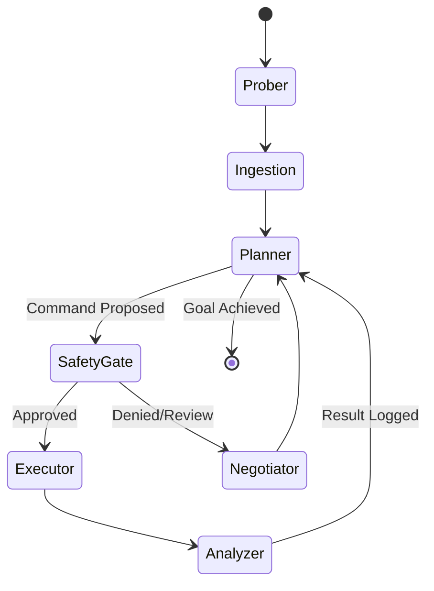

# 🏗️ DevOps Agent Architecture

This document provides a comprehensive technical deep-dive into the internals of the DevOps Agent. It is intended for developers, architects, and security engineers.

---

## 1. System Overview

The DevOps Agent is a **multi-layered orchestrator** that bridges the gap between Large Language Models (LLMs) and the raw execution environment (Shell, Docker, Kubernetes). 

### High-Level Layers
1.  **Orchestration Layer**: Powered by **LangGraph**, managing the stateful reasoning loop with **Phase 13 Hardening** (node isolation and error handling).
2.  **Memory Layer (GCC)**: The "Project Memory" that stores logs, findings, and lineage in an atomic, human-readable format.
3.  **Intelligence Layer**: A hybrid persistence system using **SQLite** for structured metadata and **LanceDB** for vector-based semantic retrieval with **Context Truncation**.
4.  **Interface Layer**: The **CLI Controller** and **Visualizer API/Frontend** for user interaction.

---

## 2. Core Orchestration: LangGraph Loop

We use LangGraph instead of a simple linear chain to support **cycles**, **conditional branching**, and **checkpoints**.

### The Reasoning DAG

### Node Responsibilities
*   **Prober**: Detects OS, Shell, and Tool availability (Docker, K8s, Git) at the start of every session.
*   **Ingestion**: Scans the GCC `log.md` for manual actions or missed context.
*   **Planner**: The AI "Brain." Considers goal + history + env to propose a shell command or response.
*   **Safety Gate**: A hard breakpoint. Interrupts the graph and waits for user approval via the CLI.
*   **Executor**: Uses **FastMCP** to run commands in the local shell.
*   **Analyzer**: Summarizes the tool output and logs it back into the Intelligence DB.

---

## 3. Project Memory: GCC (Git Context Controller)

GCC is the "Atomic Soul" of the agent. Every session is treated as a Git-like node in a persistent DAG.

### File Structure
Every session folder in `.GCC/sessions/` contains:
*   `log.md`: The linear history of AI thoughts and Human commands (+ reasoning).
*   `commit.md`: A curated list of milestones and discoveries ("Commits").
*   `metadata.yaml`: Static session info (Goal, Created At, Parent ID).

### Context Resumption
When a session is resumed, GCC performs a **Differential Sync**:
1.  It identifies the `last_synced_count` from metadata.
2.  It reads the delta since that count in `log.md`.
3.  It generates a **Handover Note** for the Planner if manual human actions were detected.

---

## 4. Intelligence Layer: Hybrid Retrieval

We solve the "Context Bloat" problem by separating immediate state from long-term memory.

| Component | Technology | Role |
| :--- | :--- | :--- |
| **Relational** | SQLite | Tracks sessions, forking lineage, skill usage, and command statistics. |
| **Semantic** | LanceDB | Stores vector embeddings of all past session logs and skill definitions. |
| **Ingestion** | Platinum Envelopes | Wraps every memory in a structured XML/JSON boundary to preserve metadata during RAG. |

### Semantic Retrieval Flow
1.  Input: *"I remember fixing this in the prod cluster yesterday."*
2.  Search: Agent performs a vector search in LanceDB across all `session_id` tags.
3.  Result: The "Platinum Envelope" of the relevant session is retrieved and injected into the Planner's system prompt.

---

## 5. Visualizer & API Bridge

The Visualizer provides a HUD (Heads-Up Display) for the GCC tree.

*   **FastAPI Backend**: Serves as a bridge, querying the Intelligence SQLite DB and reading the `.GCC` filesystem to provide JSON representations of the DAG.
*   **React Frontend (Bun)**: A high-performance dashboard.
*   **D3.js Graph**: Uses a hierarchical stratification algorithm to render the parent-child session branches.
*   **Live Sync**: Uses non-blocking polling (2s) to scroll the execution logs as the agent works.

---

## 6. Observability & Security (Phase 15)

We integrate **Langfuse** for local-first, self-hosted observability. This ensures all reasoning traces stay within the user's infrastructure.

### Local Observability Stack
- **Backend**: Self-hosted Langfuse via `docker-compose.langfuse.yml`.
- **Integration**: Native `langfuse.langchain` CallbackHandler injected into LangGraph.
- **Feedback Loop**: User approvals (+1.0) and denials (0.0) are automatically mapped to Langfuse Scores for future fine-tuning.

### The Redaction Middleware
Before any trace is sent to the local dashboard:
1.  **Regex Scanners**: Identify patterns like `AIza...` (Google), `Bearer ...`, or `PASSWORD=...`.
2.  **Replacement**: Masks sensitive strings with `[REDACTED]`.
3.  **Local First**: Tracing is asynchronous and handles connection failures gracefully with a "No-Op" fallback.

---

## 8. Advanced CLI UX: Streaming & Negotiation

The Interface layer uses a high-performance event loop to maintain responsiveness.

### Real-Time Streaming loop
We utilize LangGraph’s `astream_events(version="v1")` to intercept three critical event types:
1.  `on_chat_model_stream`: Tokens are piped directly into a `Rich.Markdown` buffer for live rendering.
2.  `on_node_start`: Triggers status updates in the **Live HUD** (status bar).
3.  `on_tool_start`: Specifically intercepts shell commands to display the active process in the HUD.

### The "Intelligent Negotiator" Node
The Negotiator node operates on the high-level system state after a `SafetyGate` interrupt:
*   **Intent Classification**: It passes the user's input through a regex/classifier to distinguish between *Approval* ("go for it"), *Denial* ("stop"), and *Redirection* ("try X").
*   **Hint Injection**: If Redirection is detected, the user's specific instruction is injected as a **Higher-Order Hint** into the Planner's system prompt for the next turn, forcing a strategic pivot.

---

## 9. Resilience & Hardening (Phase 13)

To ensure production-grade reliability, the agent includes an "Expert System Audit" layer:

### Advanced PII Masking
The `Redactor` utility uses multi-pass regex to catch:
- **Base64 Certs**: Identifies long Base64 strings (Kubeconfigs).
- **Private Keys**: Multi-line PEM block detection.
- **Environment Secrets**: Variable-value pair detection for `TOKEN`, `KEY`, and `PASSWORD`.

### Context Management
To prevent **Context Window Overflow**, we implement `ContextManager.trim_messages()`:
- **Rolling Window**: Keeps the last 15 messages (approx. 7 turns) of history.
- **System Anchor**: Always preserves the critical OS/Shell system prompt regardless of history length.

### Async Safety
- **Thread Offloading**: Blocking I/O (like `shutil.copytree` for session branching) is wrapped in `asyncio.to_thread`.
- **Decoding Robustness**: The MCP layer uses `errors='replace'` during UTF-8 decoding to prevent crashes on binary or malformed shell output.
- **Node Isolation**: Reasoning nodes are implementation-isolated class methods, preventing state leakage between concurrent sessions.

---

## 7. Performance Rationales

*   **Why Bun?**: We chose Bun for the visualization layer for near-instant dependency management and faster dev-server startup.
*   **Why uv?**: Ensures reproducible Python environments and 10x faster package installation than standard pip.
*   **Why SQLite?**: Zero-config, single-file database that perfectly complements the local-first nature of the GCC system.
