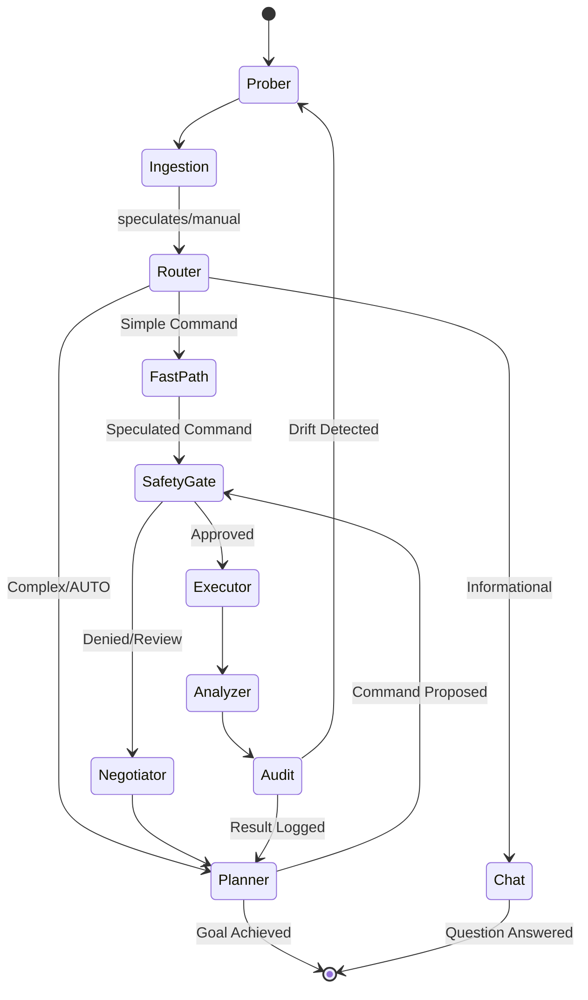

# 🏗️ DevOps Agent Architecture

This document provides a comprehensive technical deep-dive into the internals of the DevOps Agent. It is intended for developers, architects, and security engineers.

---

## 1. System Overview

The DevOps Agent is a **multi-layered orchestrator** that bridges the gap between Large Language Models (LLMs) and the raw execution environment (Shell, Docker, Kubernetes). 

### High-Level Layers
1.  **Orchestration Layer**: Powered by **LangGraph**, managing the stateful reasoning loop with **Phase 13 Hardening** (node isolation and error handling).
2.  **Memory Layer (GCC)**: The "Project Memory" that stores logs, findings, and lineage in an atomic, human-readable format.
3.  **Intelligence Layer**: A structured persistence system using **SQLite** for session metadata, skill usage stats, and command history. Semantic retrieval is handled via **Static Skill Injection** (zero-latency, no vector search).
4.  **Interface Layer**: The **CLI Controller** and **Visualizer API/Frontend** for user interaction.

---

## 2. Core Orchestration: LangGraph Loop

We use LangGraph instead of a simple linear chain to support **cycles**, **conditional branching**, and **checkpoints**.

### The Reasoning DAG

### Node Responsibilities
*   **Prober**: Detects OS, Shell, and Tool availability (Docker, K8s, Git) at the start of every session.
*   **Ingestion**: Scans the GCC `log.md` for manual actions or missed context with offset-based efficiency.
*   **Router**: A high-speed reflexive node that speculates if a query is a simple command, a conversational question, or complex strategy.
*   **Chat**: A specialized node for informational queries that bypasses tool execution for maximum safety and speed.
*   **Planner**: The heavy AI "Brain." Considers goal + history + env for complex, multi-step orchestration.
*   **Safety Gate**: A hard breakpoint. Interrupts the graph and waits for user approval via the CLI.
*   **Executor**: Uses **FastMCP** to run commands in the local shell.
*   **Analyzer**: Summarizes the tool output and logs it back into the Intelligence DB.
*   **Audit**: Expert system that checks for environment drift, identical command loops, and turn limits.

---

## 3. Project Memory: GCC (Git Context Controller)

GCC is the "Atomic Soul" of the agent. Every session is treated as a Git-like node in a persistent DAG.

### File Structure
Every session folder in `.GCC/sessions/` contains:
*   `log.md`: The linear history of AI thoughts and Human commands (+ reasoning).
*   `commit.md`: A curated list of milestones and discoveries ("Commits").
*   `metadata.yaml`: Static session info (Goal, Created At, Parent ID).

### Context Resumption
When a session is resumed, GCC performs a **Differential Sync**:
1.  It identifies the `last_synced_count` from metadata.
2.  It reads the delta since that count in `log.md`.
3.  It generates a **Handover Note** for the Planner if manual human actions were detected.

---

## 4. Intelligence Layer: SQLite-Backed Metadata

All persistent agent state is stored in a single **SQLite** database (`intelligence.db`). RAG and vector search were decommissioned in favour of **Static Skill Injection** which gives zero-latency, constant-time context at no retrieval cost.

| Component | Technology | Role |
| :--- | :--- | :--- |
| **Relational** | SQLite | Tracks sessions, forking lineage, skill usage, and command statistics. |
| **Skill Context** | Static Injection | All `SKILL.md` files loaded once into memory at startup and concatenated into the system prompt each turn. No vector search needed. |
| **Incremental Ingestion** | Offset-based | GCC `log.md` is only read from `last_synced_count`, keeping ingestion O(delta) not O(total). |

> **Why RAG was removed**: Dynamic retrieval added 1–3s latency per turn with no accuracy benefit over static injection at the current skill-set size. The vector store (LanceDB) was a dependency with no return.

---

## 5. Visualizer & API Bridge

The Visualizer provides a high-fidelity HUD (Heads-Up Display) for the GCC tree, optimized for information density and execution tracing.

### 5. Visualizer & API Bridge

The Visualizer provides a high-fidelity HUD (Heads-Up Display) for the GCC tree, optimized for information density and execution tracing.

*   **FastAPI Backend**: Serves as a bridge, querying the Intelligence SQLite DB and reading the `.GCC` filesystem.
    *   **Enriched Telemetry**: Automatically detects and computes session metrics (command counts, OS, Shell) via the `DatabaseService`.
    *   **Secure Exports**: Provides path-resolve hardened endpoints for downloading `log.md` and `commit.md` directly.
*   **React Frontend (Bun)**: A three-column dashboard (Navigator, Graph, Details).
*   **Optimal Layout**: Grid system optimized with a wider Navigator (`380px`) and Detail Panel (`450px`) for high-information density.
*   **D3.js Hierarchy**: Uses `d3.tree()` with `nodeSize([48, 80])` and `d3.linkVertical()` to render a deterministic, top-down vertical tree of session branches.
*   **Hardened Parser**: Log rendering logic includes a comprehensive interaction parser with resilient fallbacks for unstructured text, ensuring 100% data visibility.
*   **Live Sync**: Polling ensures execution logs and metadata stream in real-time as the agent works.

---

## 6. Observability & Security (Phase 15)

We integrate **Langfuse** for local-first, self-hosted observability. This ensures all reasoning traces stay within the user's infrastructure.

### Local Observability Stack
- **Backend**: Self-hosted Langfuse via `docker-compose.langfuse.yml`.
- **Integration**: Native `langfuse.langchain` CallbackHandler injected into LangGraph.
- **Feedback Loop**: User approvals (+1.0) and denials (0.0) are automatically mapped to Langfuse Scores for future fine-tuning.

### The Redaction Middleware
Before any trace is sent to the local dashboard:
1.  **Regex Scanners**: Identify patterns like `AIza...` (Google), `Bearer ...`, or `PASSWORD=...`.
2.  **Replacement**: Masks sensitive strings with `[REDACTED]`.
3.  **Local First**: Tracing is asynchronous and handles connection failures gracefully with a "No-Op" fallback.

---

## 8. Advanced CLI UX: Streaming & Negotiation

The Interface layer uses a high-performance event loop to maintain responsiveness.

### Real-Time Streaming loop
We utilize LangGraph’s `astream_events(version="v1")` to intercept three critical event types:
1.  `on_chat_model_stream`: Tokens are piped directly into a `Rich.Markdown` buffer for live rendering.
2.  `on_node_start`: Triggers status updates in the **Live HUD** (status bar).
3.  `on_tool_start`: Specifically intercepts shell commands to display the active process in the HUD.

### The "Intelligent Negotiator" Node
The Negotiator node operates on the high-level system state after a `SafetyGate` interrupt:
*   **Intent Classification**: It passes the user's input through a regex/classifier to distinguish between *Approval* ("go for it"), *Denial* ("stop"), and *Redirection* ("try X").
*   **Hint Injection**: If Redirection is detected, the user's specific instruction is injected as a **Higher-Order Hint** into the Planner's system prompt for the next turn, forcing a strategic pivot.

---

## 9. Resilience & Hardening (Phase 13)

To ensure production-grade reliability, the agent includes an "Expert System Audit" layer:

### Advanced PII Masking
The `Redactor` utility uses multi-pass regex to catch:
- **Base64 Certs**: Identifies long Base64 strings (Kubeconfigs).
- **Private Keys**: Multi-line PEM block detection.
- **Environment Secrets**: Variable-value pair detection for `TOKEN`, `KEY`, and `PASSWORD`.

### Context Management
To prevent **Context Window Overflow**, we implement `ContextManager.trim_messages()`:
- **Rolling Window**: Keeps the last 15 messages (approx. 7 turns) of history.
- **System Anchor**: Always preserves the critical OS/Shell system prompt regardless of history length.

### Async Safety
- **Thread Offloading**: Blocking I/O (like `shutil.copytree` for session branching) is wrapped in `asyncio.to_thread`.
- **Decoding Robustness**: The MCP layer uses `errors='replace'` during UTF-8 decoding to prevent crashes on binary or malformed shell output.
- **Node Isolation**: Reasoning nodes are implementation-isolated class methods, preventing state leakage between concurrent sessions.

### Nuclear Reset Logic
To support clean developer transitions and security compliance, the agent implements a `reset --nuclear` command:
- **Filesystem Purge**: Recursively deletes the `.GCC/` directory.
- **Database Wipe**: Closes connections and deletes `intelligence.db` (SQLite).
- **Confirmation Flow**: Enforces a CLI-level confirmation `y/n` before execution.

---

## 10. Performance & Optimization (V0.3 — Phase 6 Hardened)

To achieve sub-5s TTFT, the agent implements several performance-first architectural patterns.

### Phase 6: Stability & Windows Hardening

Phase 6 addressed systemic hangs and crashes identified during benchmark profiling on Windows:

| Fix | Root Cause | Solution |
|---|---|---|
| **Probe timeout** | `docker info` on unreachable daemon hung forever | `asyncio.wait_for(..., timeout=5.0)` in `run_probe()` |
| **Stable env hash** | Raw `kubectl` error strings varied per call → false drift → reprobe loop | Hash now uses `kubectl_active: bool` instead of raw error dict |
| **Audit double-probe** | `audit_node` called `get_system_info()` independently of turn-level cache | `audit_node` now strictly uses `self.cached_sys_info` |
| **FastPath None-guard** | `_detect_and_handle_pivot` crashed when `FAST_PATH_ENABLED=false` | Added `and self.fast_llm is not None` guard before invocation |
| **SQLite WAL lock** | Registry singleton held WAL lock across benchmark scenarios | Added `timeout=15` to `aiosqlite.connect()` + background task drain before close |

### Distributed LLM Architecture
The system supports split-execution between the "Brain" (Heavy Reasoning) and the "Reflex" (Speculative Router) LLMs.
*   **Brain model**: Handles the heavy `Planner` node. Usually a large, tool-capable model (e.g., `devstral:24b`).
*   **Reflex model**: Handles the `Router` and `Chat` nodes. A smaller, low-latency model (e.g., `llama3.2:3b`).
*   **Distributed Hosts**: The reflex model can be hosted on a separate Ollama instance via `FAST_PATH_HOST`.

### Static Skill Injection
Replaces dynamic RAG with **Static Skill Injection**:
1.  **Startup Loading**: All `SKILL.md` files are loaded into memory at agent initialization.
2.  **Zero-Latency Context**: Relevant skill documentation is concatenated into the system prompt once per turn — constant-time access, no vector search overhead.

### Incremental Ingestion
Context bloat is managed by **Offset-based Ingestion**. The agent tracks `last_synced_count` for `log.md` and only parses new entries, significantly reducing ingestion latency in long-running sessions.

---

## 7. Performance Rationales

*   **Why Bun?**: We chose Bun for the visualization layer for near-instant dependency management and faster dev-server startup.
*   **Why uv?**: Ensures reproducible Python environments and 10x faster package installation than standard pip.
*   **Why SQLite?**: Zero-config, single-file database that perfectly complements the local-first nature of the GCC system.
