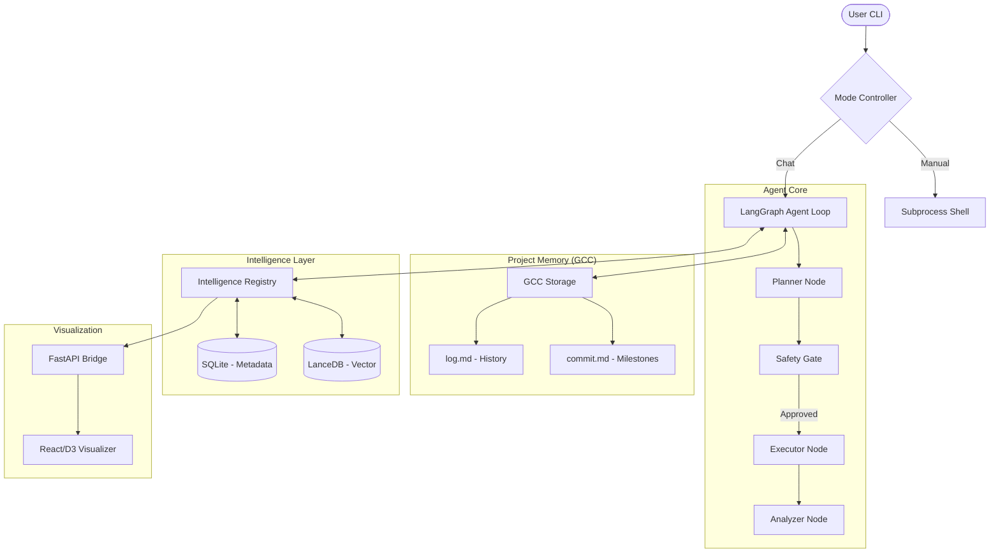

# 🤖 DevOps Agent — Terminal-Native OS-Aware Orchestrator

[](https://fastapi.tiangolo.com/)
[](https://reactjs.org/)
[](https://bun.sh/)
[](https://github.com/langchain-ai/langgraph)

A premium, state-of-the-art AI assistant designed for high-stakes DevOps engineering. Built on **LangGraph**, **GCC (Git Context Controller)**, and **Ollama**, this agent doesn't just chat; it executes, reasons, and remembers every action inside your terminal.

---

## 🌟 Key Features

*   **🧠 LangGraph Intelligence**: Multi-node reasoning (Planner -> Safety -> Executor -> Analyzer) for complex, multi-step problem solving.
*   **📜 GCC (Git Context Controller)**: Git-inspired project memory with branching lineage, logs, and findings.
*   **🛡️ Safety Gate**: Built-in human-in-the-loop approval system for all terminal commands.
*   **🔭 Visualizer Dashboard**: Interactive D3.js branching tree graph to explore your session history in Light/Dark mode.
*   **⚡ AI Summoner (Ctrl+R)**: Seamlessly switch between Manual Shell and AI Chat without losing context.
*   **🌊 Ollama-Style Streaming**: Real-time token streaming for all AI responses (Markdown rendered live).
*   **🖥️ Live Status HUD**: A dynamic status bar tracking reasoning nodes (`🧠 Planning`, `🛠️ Executing`, etc.).
*   **💬 Intelligent Safety Gate**: Support for Natural Language approvals (e.g., *"Sure, go ahead"*) and expert redirection (*"Try X instead"*).
*   **🧠 Intelligence Layer**: Hybrid memory using SQLite (structured) and LanceDB (semantic/vector) with "Platinum Envelope" structured ingestion.
*   **👁️ Observability**: Full local tracing and token monitoring via **Langfuse** with automated PII/Secret redaction and feedback scoring.
*   **🛡️ Production-Grade Hardening**: Built-in protection against PII leaks, context window overflow, and malformed command output.

---

## 🏗️ Technical Architecture



---

## 🚀 Quick Start

### 1. Prerequisites
- **Python 3.10+** (managed via `uv`)
- **Ollama** (running `devstral:24b` or equivalent)
- **Bun** (for the visualizer)

### 2. Installation
```bash
# Clone the repo
git clone https://github.com/your-repo/devops-agent-cli.git
cd DevOpsAgent-cli

# Setup environment
cp .env.example .env
# Edit .env with your OLLAMA_HOST and LANGFUSE keys

# Install dependencies
uv sync
```

### 3. Usage
```bash
# Start a new session
uv run devops-agent new "Fix the slow response time in my local Kubernetes cluster"

# Enter manual mode (shell)
# [While in Agent Chat] Type 'manual'
# [While in Manual] Press Ctrl+R to return to AI

# Optional: Launch Observability Dashboard
docker-compose -f docker-compose.langfuse.yml up -d

# Launch Visualizer
uv run python src/cli/api.py
cd src/cli/visualizer && bun run dev
```

---

## 📄 Documentation

- [**ARCHITECTURE.md**](ARCHITECTURE.md) - Deep technical dive into the core engine.
- [**user_guide.md**](user_guide.md) - Step-by-step setup and feature usage.
- [**GCC_git.md**](GCC_git.md) - Understanding the Git Context Controller logic.
- [**Langfuse_use.md**](Langfuse_use.md) - Local Observability and Monitoring guide.

---

## ⚖️ License
MIT © 2026 DevOps Agent Team
